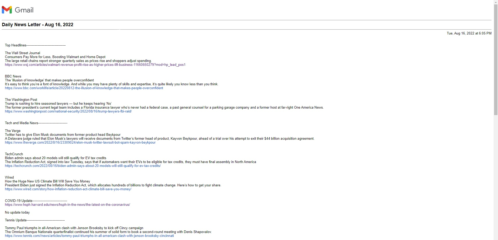
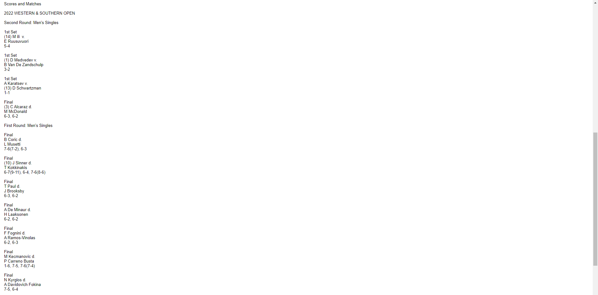

# Personal Newsletter 📰

## Overview
This python script sends an email to the desired email address containing the top headlines of the day, technology and media news, a COVID-19 update, and daily tennis news and ATP tennis scores.  

### News Sources

Top Headlines:
1. [The Wall Street Journal](https://www.wsj.com/)
2. [BBC News](https://www.bbc.com/news)
3. [The Washington Post](https://www.washingtonpost.com/)

Technology and Media
1. [The Verge](https://www.theverge.com/)
2. [TechCrunch](https://techcrunch.com/)
3. [Wired](https://www.wired.com/)

COVID-19 Update: [Harvard School of Public Health](https://www.hsph.harvard.edu/news/hsph-in-the-news/the-latest-on-the-coronavirus/)

Tennis News: [Tennis.com](https://www.tennis.com/)

Tennis Scores: [ESPN](http://m.espn.com/general/tennis/dailyresults?wjb)

## Technologies Used
- [NewsAPI](https://newsapi.org/) (Obtains data from news sources)
- Beautiful Soup (Web scraper)
- smtplib (Sends the email)

## Usage

### Requirements
- [Register for a NewsAPI API key](https://newsapi.org/register)

### Setting up
Install beautifulsoup4, lxml, newsapi-python, and requests libraries

```
pip install beautifulsoup4

pip install lxml

pip install newsapi-python

pip install requests
```

Set up environment variables
- Choose one email address to send and recieve the email (The script will have the email send the newsletter to itself)
```
pythonEmailUser = 'example@email.com'
```
- Set the password of the email in order to login
```
pythonEmailPSWD = 'examplePassword'
```
- Set the NewsAPI API key
```
newsAPIKey = 'example key'
```

### Run
```
python newsLetter.py
```
## Example Email



